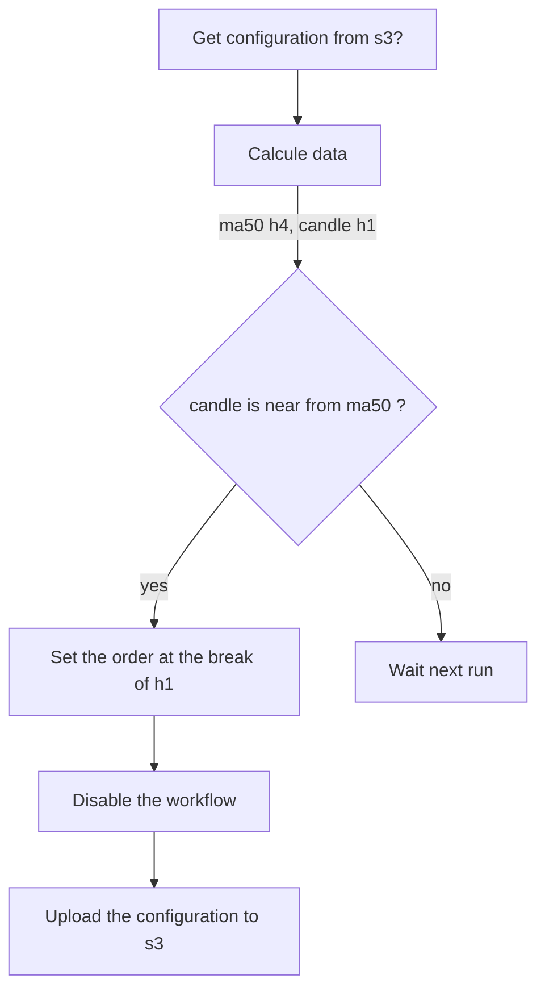

### A workflow needs:
* A referential index
* A cfd to place order
* An end date
* A status (enable, disable)
* A condition to trigger an order

### Example:
- The candle h1 closes near or above the ma50 h4
- Trigger a sell order as a break h1
- Disable the workflow (to avoid multiple orders)

### Implementation (based on above example):
- Every hour, the cron runs workflows
- Calculate the needed data (ma50 h4, previous candle h1)

### Storage

Workflows are now stored in **DynamoDB** for better scalability and management. The `workflows` table uses UUID as the primary key with the following schema:

**Primary Key:**
- `id` (String): UUID v4 identifier

**Attributes:**
- `name` (String): Workflow name
- `index` (String): Reference index (e.g., "DAX.I")
- `cfd` (String): CFD for order placement (e.g., "GER40.I")
- `enable` (Boolean): Workflow status
- `dry_run` (Boolean): Dry run mode flag
- `is_us` (Boolean): US market flag
- `end_date` (String, nullable): Workflow end date (ISO 8601)
- `conditions` (List): Array of condition objects
- `trigger` (Map): Trigger configuration
- `created_at` (String): Creation timestamp
- `updated_at` (String): Last update timestamp

### Migration from YAML

To migrate existing workflows from `workflows.yml` to DynamoDB:

```bash
poetry run python scripts/migrate_workflows.py
```

This will:
1. Read workflows from the YAML file
2. Generate UUIDs for each workflow
3. Store them in the DynamoDB `workflows` table
4. Preserve all workflow properties and nested structures

### Web UI

The workflow management UI is available at `/workflows` and provides:
- List all workflows with filtering and sorting
- Filter by: status (enabled/disabled), index, indicator type, mode (dry run/live)
- Sort by: name, index, end date
- View detailed workflow configuration
- Real-time status updates

### Legacy YAML Format

The original YAML-based configuration is maintained for reference:
```yaml
workflows:
    - name: sell ma50 h4 dax
      index: DAX.I
      cfd: GER40.I
      end_date: 2024/04/01
      enable: true
      conditions:
        - indicator:
            name: ma50
            ut: h4
          close:
            direction: below
            ut: h1
            spread: 10
      trigger:
        ut: h1
        signal: breakout
        location: lower
```




