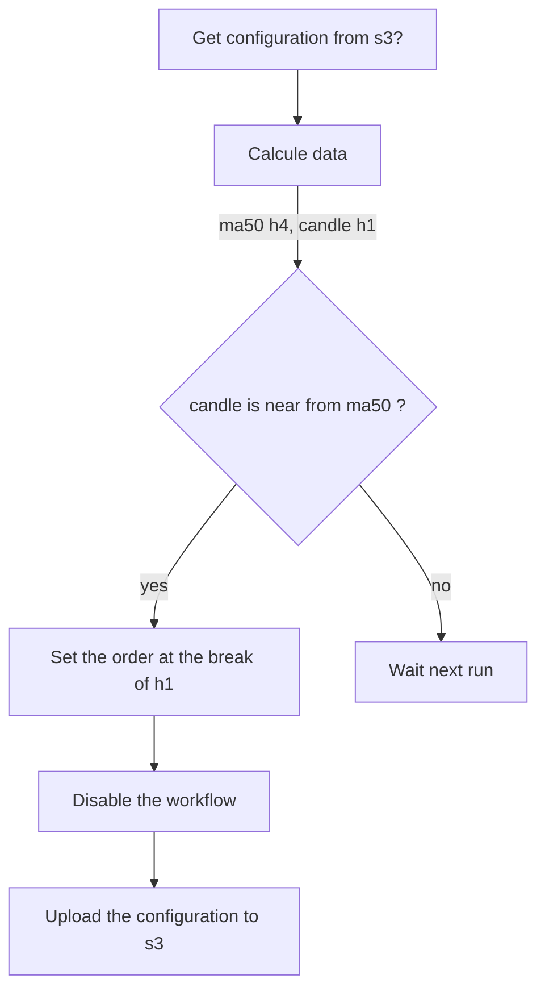

### A workflow needs:
* A referential index
* A cfd to place order
* An end date
* A status (enable, disable)
* A condition to trigger an order

### Example:
- The candle h1 closes near or above the ma50 h4
- Trigger a sell order as a break h1
- Disable the workflow (to avoid multiple orders)

### Implemention (base on above example):
- Every hour, the cron runs workflows
- Calculate the needed data (ma50 h4, previous candle h1)


Configuration fiile will be a yaml which describes the workflow. Here is an example:
```yaml
workflows:
    - name: sell ma50 h4 dax
      index: DAX.I
      cfd: GER40.I
      end_date: 2024/04/01
      enable: true
      conditions:
        - indicator:
            name: ma50
            ut: h4
          close:
            direction: below
            ut: h1
            spread: 10
      trigger:
        ut: h1
        signal: breakout
        location: lower
```




